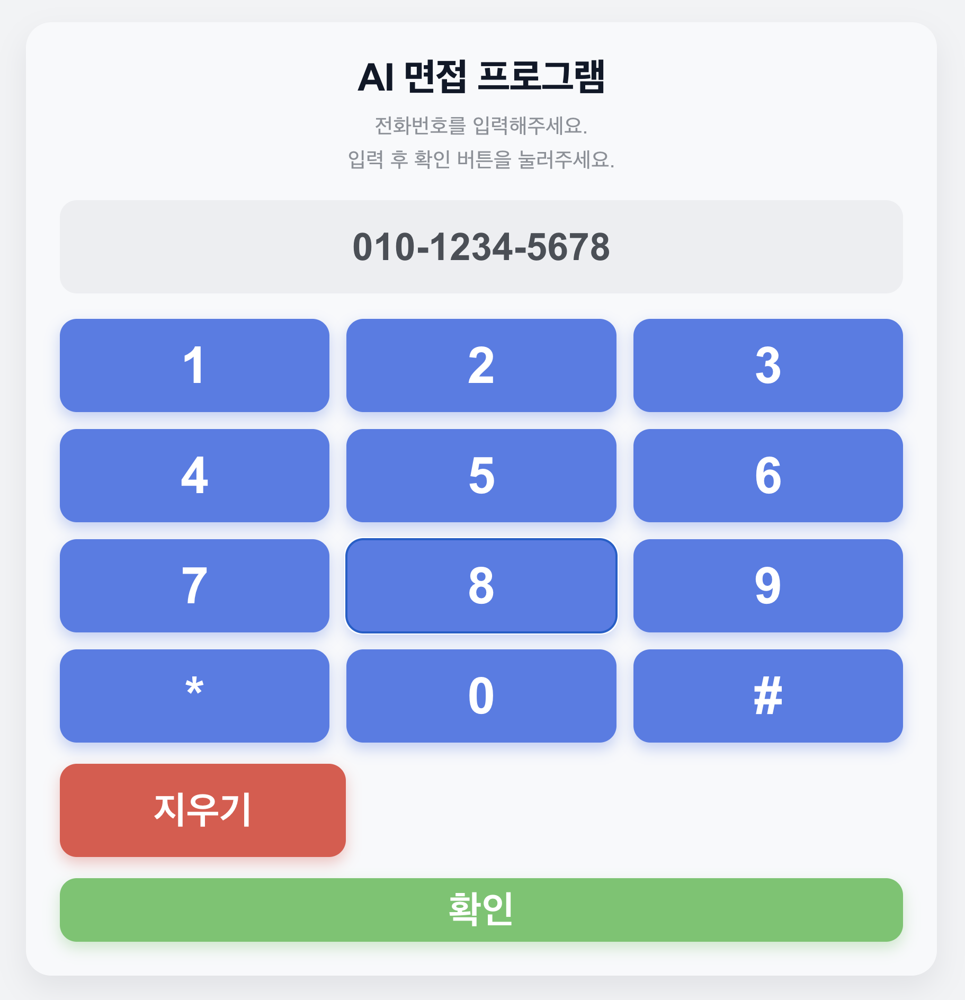
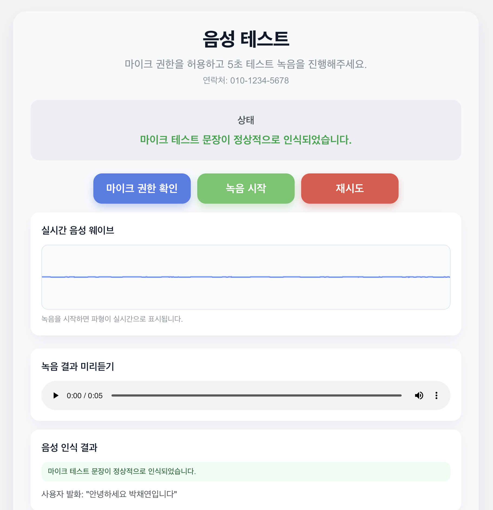
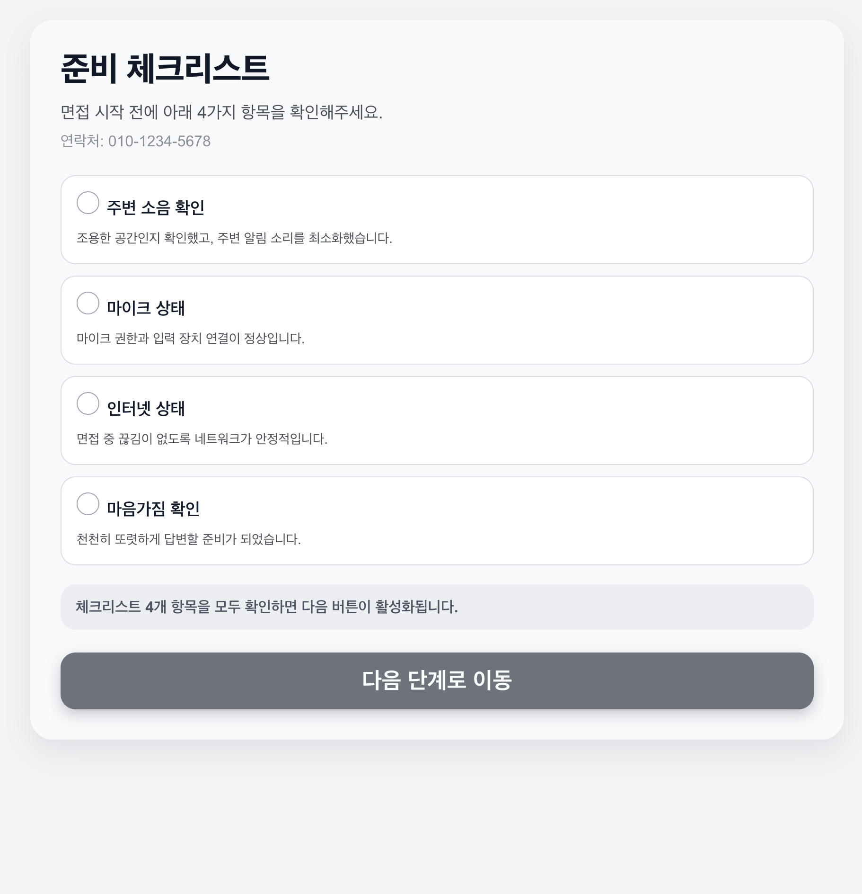
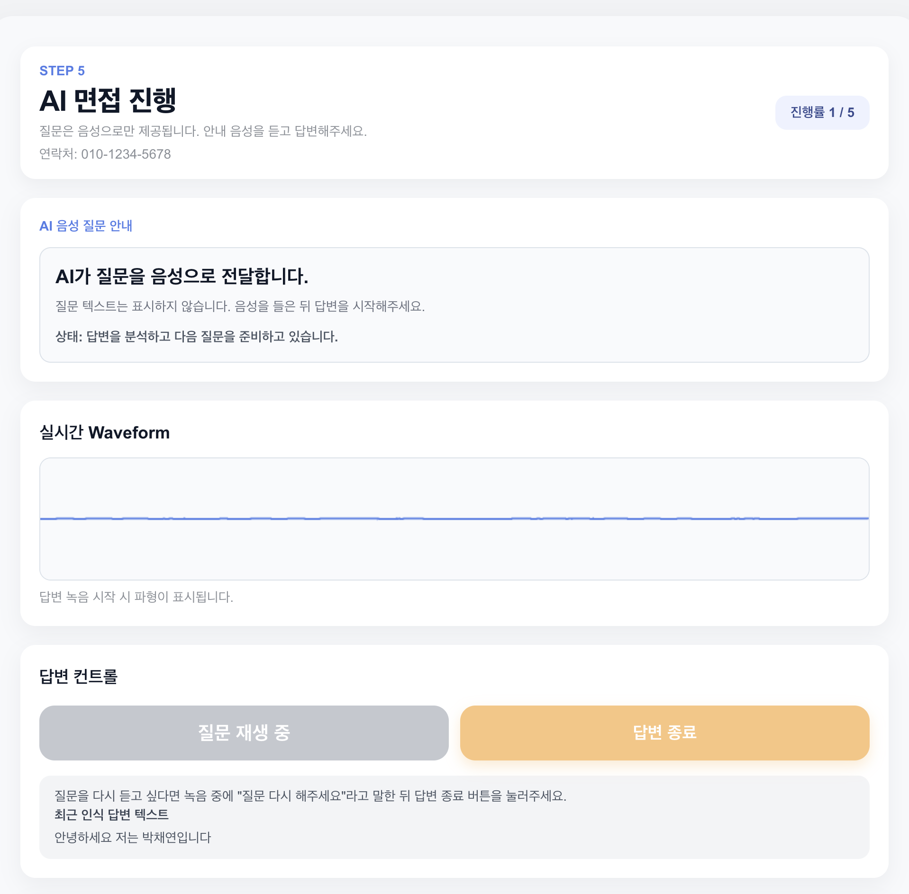
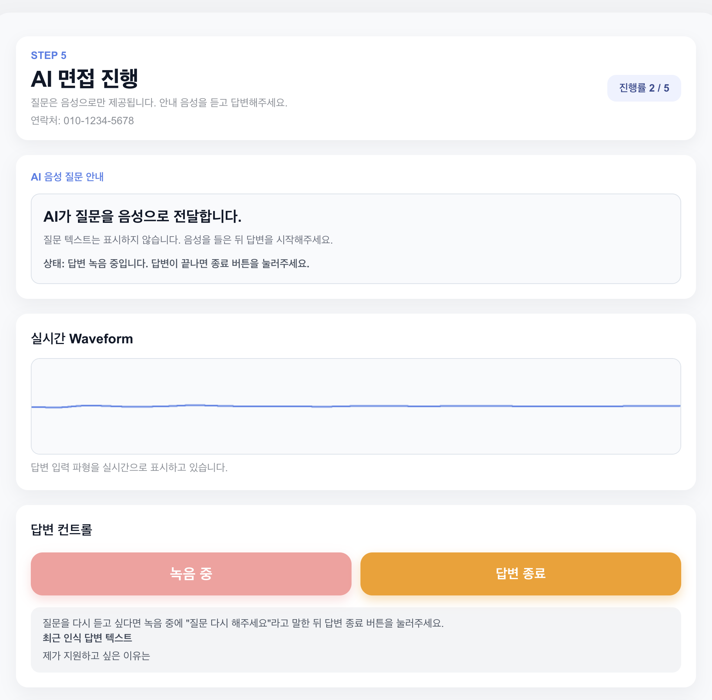
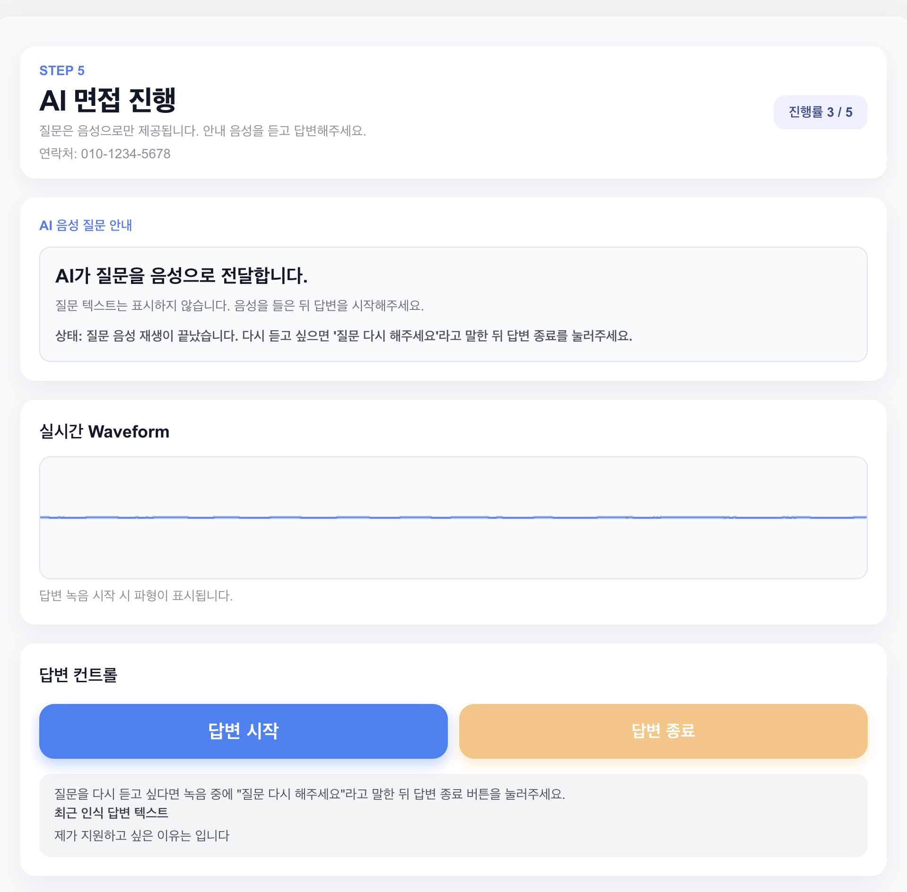

# AI Interview Assistant

## Overview
AI Interview Assistant is a web-based application that evaluates interview responses and generates feedback using LLMs.

The goal of this project is to simulate an interview environment and provide users with structured, AI-generated feedback on their answers.

---

## Features
- Interview question and answer flow
- LLM-based response evaluation
- Feedback generation based on user answers
- Simple web interface for interaction

---

## Demo

  
  

  
  

  
  

---

## Tech Stack
- Frontend: Next.js, TypeScript
- AI: OpenAI API
- Tools: Git, npm

---

## What I Did
- Designed the overall interview evaluation flow
- Built the web-based UI using Next.js
- Integrated LLM API for response evaluation and feedback generation
- Implemented fallback logic for handling API limitations (e.g., quota issues)

---

## Key Learning
- Learned how to integrate LLM APIs into real-world applications
- Designed a simple evaluation pipeline for user input
- Handled API limitations by implementing fallback strategies

---

## Future Work
- Improve evaluation consistency with structured scoring
- Store interview history and analytics
- Enhance UI/UX for better user experience
